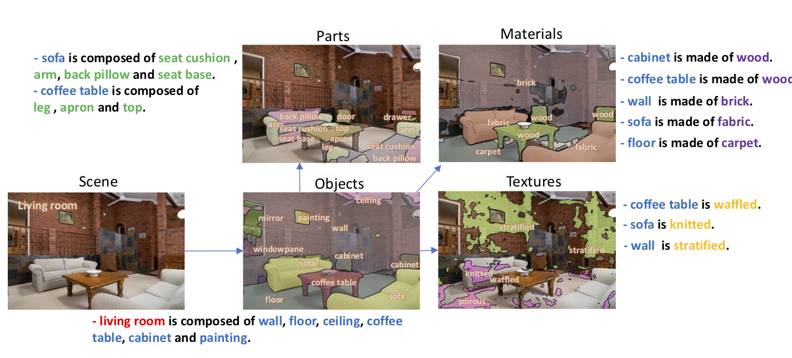
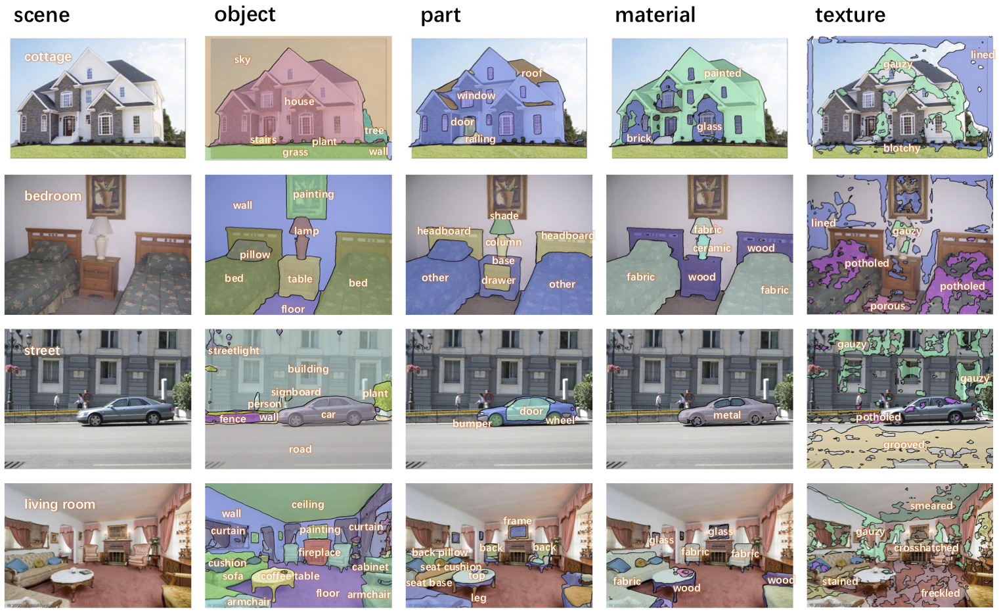

# Unified Perceptual Parsing for Scene Understanding

This is a pyTorch implementation of Unified Perceptual Parsing network on Broden+ dataset and ADE20K dataset. This work is published at ECCV'18 [Unified Perceptual Parsing for Scene Understanding](https://arxiv.org/abs/1807.10221), to which [Tete Xiao](http://tetexiao.com), [Yingcheng Liu](https://github.com/firstmover), and [Bolei Zhou](http://people.csail.mit.edu/bzhou/) contribute equally.

Broden+ dataset is the standardized Broden dataset, previously proposed in [Network Dissection](https://github.com/CSAILVision/NetDissect). ADE20K dataset is a recent image dataset for [scene parsing](https://github.com/CSAILVision/semantic-segmentation-pytorch). 



## What is Unified Perceptual Parsing?

The human visual system is able to extract a remarkable amount of semantic information from a single glance. We not only instantly parse the objects contained within, but also identify the fine-grained attributes of objects, such as their parts, textures and materials. Motivated by this, we define the task of Unified Perceptual Parsing as the recognition of many visual concepts as possible from a given image. Possible visual concepts are organized into several levels: from scene labels, objects, and parts of objects, to materials and textures of objects.


[From left to right (inference results): scene classification, and object, part, material, and texture parsing]

## Highlights
- Classify scene and parse objects, parts, materials and textures at a single and efficient forward.

- Use Precise RoI Pooling (PrRoIPooling) instead of Adaptive Pooling for Pyramid Pooling Module (PPM). See [Acquisition of Localization Confidence for Accurate Object Detection](https://arxiv.org/abs/1807.11590) paper for details about PrRoIPooling and [github page](https://github.com/vacancy/PreciseRoIPooling) for implementation details.

- Syncronized Batch Normalization on PyTorch.

- Dynamic scales of input for training with multiple GPUs.

- Support state-of-the-art PyTorch 1.0

## Environment
The code is developed under the following configurations.
- Hardware: 2-8 GPUs (with at least 12G GPU memories) (change ```[--num_gpus NUM_GPUS]``` accordingly)
- Software: Ubuntu 16.04.3 LTS, CUDA>=8.0, ***Python>=3.5***, ***PyTorch>=0.4.0 (PyTorch 1.0 supported)***
- Library: opencv, scipy, colormath, tqdm, PyTorch compiled with cffi

*Warning:* We don't support the outdated Python 2 anymore. PyTorch 0.4.0 or higher is required to run the code.

## Quick start: Use pretrained models

### Pertrained models for semantic segmentation on ADE20K

We have released the UPerNet with state-of-the-art performance proposed in our paper as baseline for parsing. UPerNet is based on Feature Pyramid Network (FPN) and Pyramid Pooling Module (PPM), with down-sampling rate of 4, 8 and 16. It doesn't need dilated convolution, a operator that is time-and-memory consuming. Without bells and whistles, it is comparable or even better compared with PSPNet, while requires much shorter training time and less GPU memory. E.g., you cannot train a PSPNet-101 on TITAN Xp GPUs with only 12GB memory, while you can train a UPerNet-101 on such GPUs. Please refer to [semantic-segmentation-pytorch](https://github.com/CSAILVision/semantic-segmentation-pytorch) for codes and models.

### Pretrained models for unified perceptual parsing on Broden+

You can use our pretrained models in PyTorch to segment input image. The usage is as follows:

1. If you're using PyTorch>=1.0 and on branch master or PyTorch 1.0, skip this step. If you're using 0.4<=PyTorch<1.0, please compile Precise RoI Pooling operator first (***Please check out to pytorch0.4 branch!!!***). It requires PyTorch compiled with ```cffi``` and only supports CUDA (CPU mode is not implemented). To compile the essential components:

```bash
    cd lib/nn/prroi_pool
    ./travis.sh
```  
You may need ```nvcc``` for this step. If it cannot find the path to ```cuda.h```, do

```bash
    export CPATH=/PATH/TO/YOUR/CUDA/include && ./travis.sh
```

2. Now you're good to go! Here is a simple demo to do inference on a single image:

```bash
chmod +x demo_test.sh
./demo_test.sh
```

This script downloads trained models and a test image, runs the test script, and saves predicted segmentation (.png) to the working directory.

3. Input arguments: (see full input arguments via python3 test.py -h)
```bash
usage: test.py [-h] --test_img TEST_IMG --model_path MODEL_PATH
               [--suffix SUFFIX] [--arch_encoder ARCH_ENCODER]
               [--arch_decoder ARCH_DECODER] [--fc_dim FC_DIM]
               [--num_val NUM_VAL] [--num_class NUM_CLASS]
               [--batch_size BATCH_SIZE] [--imgSize IMGSIZE [IMGSIZE ...]]
               [--imgMaxSize IMGMAXSIZE] [--padding_constant PADDING_CONSTANT]
               [--segm_downsampling_rate SEGM_DOWNSAMPLING_RATE]
               [--result RESULT] [--gpu_id GPU_ID]
```

## Training on Broden+

You can train the networks and evaluate them on the Broden+ dataset

1. Download and process the Broden+ dataset.
```bash
    chmod +w download_Broden+.sh
    ./download_Broden+.sh
```
This script downloads and saves the Broden+ dataset to the ```broden_dataset``` directory, then resizes the images with at least one side longer than 512 pixels. The downloading and data processing may take some time.

2. Train a default network (ResNet-50 + UPerNet) for scene classifcation + object, part and material parsing. During training, checkpoints will be saved in folder ```ckpt```.
```bash
    python3 train.py --num_gpus 8 --arch_encoder resnet50 --arch_decoder upernet 
    --segm_downsampling_rate 4 --padding_constant 32 --num_epoch 40
```

3. Input arguments: (see full input arguments via ```python3 train.py -h ```)
```bash
usage: train.py [-h] [--id ID] [--arch_encoder ARCH_ENCODER]
                [--arch_decoder ARCH_DECODER]
                [--weights_encoder WEIGHTS_ENCODER]
                [--weights_decoder WEIGHTS_DECODER] [--fc_dim FC_DIM]
                [--num_gpus NUM_GPUS]
                [--batch_size_per_gpu BATCH_SIZE_PER_GPU]
                [--num_epoch NUM_EPOCH] [--start_epoch START_EPOCH]
                [--epoch_iters EPOCH_ITERS] [--optim OPTIM]
                [--lr_encoder LR_ENCODER] [--lr_decoder LR_DECODER]
                [--lr_pow LR_POW] [--beta1 BETA1]
                [--weight_decay WEIGHT_DECAY] [--fix_bn FIX_BN]
                [--workers WORKERS] [--imgSize IMGSIZE [IMGSIZE ...]]
                [--imgMaxSize IMGMAXSIZE]
                [--padding_constant PADDING_CONSTANT]
                [--segm_downsampling_rate SEGM_DOWNSAMPLING_RATE]
                [--random_flip RANDOM_FLIP] [--seed SEED] [--ckpt CKPT]
                [--disp_iter DISP_ITER]
```

## Evaluation on Broden+

1. Evaluate a trained network on the validation set. Add ```--visualize``` option to output visualizations as shown in teaser (w/o class labels :( 

```bash
    python3 eval_multipro.py --arch_encoder resnet50 --arch_decoder upernet --id MODEL_ID \
    --suffix SUFFIX --devices DEVICE_ID
```
***This is a multi-GPU evaluation script.*** It is extremely easy to use. For example, to run the evaluation code on 8 GPUs, simply add ```--devices 0-7```. You can also choose which GPUs to use, for example, ```--devices 0,2,4,6```. To use only a single GPU, use ```--devices 0```.

2. Input arguments: (see full input arguments via ```python3 eval_multipro.py -h ```)

## Reference

If you find the code or the pretrained models useful, please consider to cite the following paper:

Unified Perceptual Parsing for Scene Understanding. T. Xiao, Y. Liu, B. Zhou, Y. Jiang, and J. Sun. European Conference on Computer Vision (ECCV), 2018. (https://arxiv.org/abs/1807.10221)

    @inproceedings{xiao2018unified,
      title={Unified Perceptual Parsing for Scene Understanding},
      author={Xiao, Tete and Liu, Yingcheng and Zhou, Bolei and Jiang, Yuning and Sun, Jian},
      booktitle={European Conference on Computer Vision},
      year={2018},
      organization={Springer}
    }
